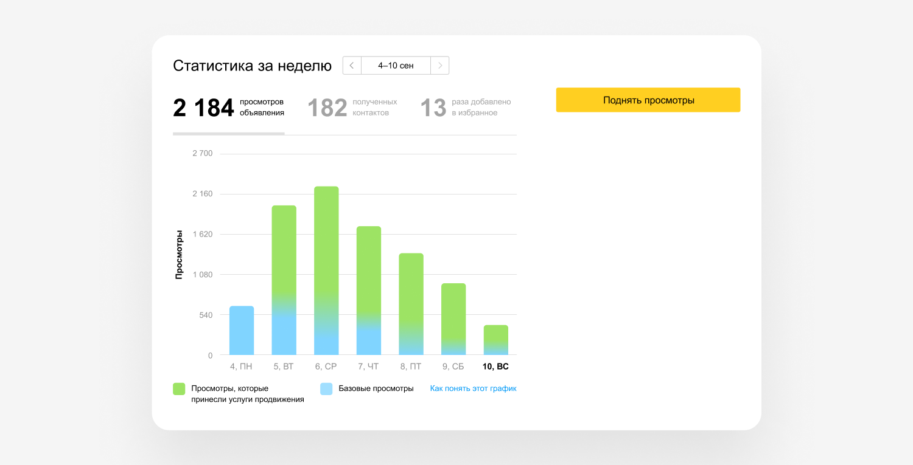
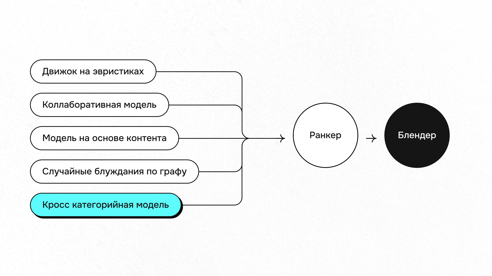

# PersonalRecSys

## Команда MARIA

Участники:

1. Волянюк Игорь Юрьевич
2. Кочетков Максим
3. Лолаев Роман (captain)
4. Трофимук Антон

## Название проекта

Персональные рекомендации

## Бизнес-логика

Что такое рекомендации
Рекомендации представляют собой индивидуализированную подборку объявлений, сформированную системой рекомендательных технологий, наиболее подходящих под запрос и интерес. Их цель – удовлетворить запрос пользователя, с которым он приходит на Авито, реализовать его потребность найти подходящее для заключения сделки предложение в объявлении.

Применение рекомендательных технологий помогает сократить путь пользователя к искомому предложению на площадке, получить наиболее качественные и релевантные предложения, а также экономить время на изучение представленного на сайте множества объявлений.

При этом, пользователь не ограничен в использовании других функциональных возможностей площадки и может выбрать иной вариант отображения объявлений, используя фильтры в поисковой выдаче на сайте, сортируя объявления, например по дате публикации.

Для улучшения пользовательского опыта Авито исключает из рекомендаций неактивные объявления, или те, что пользователь уже просматривал.

MAU В Авито - 50 миллионов человек. Для каждого из них формируются Персональные рекомендации. Они важны, так как рекомендации — это первое, что видит пользователь на Авито.

> **Профильная реклама** — профессиональный инструмент для продавцов, которые хотят еще больше продаж, заказов и звонков в дополнение к стандартным инструментам продвижения Avito. Более 20 миллионов человек будут видеть баннер с профильной рекламой на главной странице каждый день. Ценообразование работает по принципу аукциона — продавцы сами смогут устанавливать цену за переход в профиль и настраивать целевые показатели для тех, кому будет показываться реклама.  
>  
> _Тестовый период показал, что профильная реклама приносит в среднем на 8% больше контактов в дополнение к стандартным инструментам продвижения._  
> — **Герман Царев**, директор по продуктам профессиональных продавцов

В [статье](https://www.avito.ru/blog/prodvizhenie-s-prognozom-uznayte-kak-poluchat-predskazuemoe-kolichestvo-prosmotrov-na-avito) от ноября 2023 года описан сервис «Продвижение с прогнозом», который показывает, сколько просмотров и контактов приносит продвижение, включая появление объявления в ленте персональных рекомендаций. Там приводится пример графика, где видно, что объявление просмотрели 2 184 пользователя, из которых 182 связались с продавцом, и примерно 10% обращений превращаются в сделки. Это наглядно иллюстрирует, как рекомендации и продвижение увеличивают конверсию и продажи бизнеса на платформе.

## Персональные рекомендации Авито — простое решение

### 🧩 Простое решение
Использовать простые эвристики. Это позволяет покрыть до **90% кейсов**:
- Рекомендовать самые популярные объявления,
- Применять фильтры (категория, регион и т.д.),

### ✅ Когда достаточно
- На ранних запусках проекта,
- Требуется быстрый запуск,
- Не нуждаться в высокой полноте и точности.

### ⚠️ Когда недостаточно
- Требуется высокая точность,
- В случае со специфичными пользователями,
- Ожидается разнообразие, масштабируемость и устойчивость.

### 🔧 Поддержка
Простое решение со временем усложняется:
- Увеличивается число фильтров,
- Возникают конфликты между обилием фильтров,
- Требуется регулярное обновление и проверка рекомендуемых товаров.

### 🧠 Рекомендация
1. Реализовать MVP на основе правил.
2. Отслеживать метрики и ошибки.
3. При снижении эффективности — перейти на ML-модель или гибридный подход.

## Реалистичность решения проблемы с помощью машинного обучения

Машинное обучение успешно применяется для задач персонализации рекомендаций, однако важно чётко представлять границы его применимости.

### 🔍 Реалистичность и возможности ML

Применение ML к задаче персональных рекомендаций является реалистичным и проверенным на практике решением. Крупные онлайн-платформы, включая маркетплейсы, активно используют рекомендательные системы, основанные на алгоритмах машинного обучения (коллаборативная фильтрация, нейронные сети, градиентный бустинг и др.). Примером может служить рекомендационная система **Amazon**, которая эффективно обрабатывает миллиарды транзакций и пользовательских взаимодействий ежедневно.

Для **Авито**, имеющего MAU в 50 миллионов пользователей, применение ML способно значительно повысить точность и персонализацию рекомендаций. Однако стоит учитывать, что переход к сложным ML-решениям требует соответствующих ресурсов: данных, инфраструктуры и опыта команды.

### 📌 Примеры успешного применения ML

- **Коллаборативная фильтрация** успешно используется такими сервисами, как **Netflix**, **Spotify**, **YouTube** для точных персонализированных рекомендаций контента.
- **Градиентный бустинг** (например, алгоритмы **LightGBM**, **CatBoost**, **XGBoost**) хорошо подходит для табличных данных в задаче персонализации рекламных объявлений и товарных предложений, позволяя повысить конверсию.
- **Нейронные сети** способны обрабатывать сложные взаимодействия и нелинейные зависимости, обеспечивая высокую релевантность рекомендаций, что особенно полезно при масштабных и многофакторных данных, характерных для Авито.

### 📊 Технические требования

Перед внедрением ML следует оценить следующие факторы:

- **Нагрузка и масштабируемость**: ML-системы должны поддерживать обработку большого количества запросов одновременно (миллионы рекомендаций в реальном времени).
- **Скорость ответа**: Рекомендации должны генерироваться за доли секунды (до 500мс на ответ), что потребует эффективной инфраструктуры и оптимизации моделей.
- **Качество и свежесть данных**: Для обеспечения точности необходимо иметь доступ к большим объемам актуальных и размеченных данных для регулярного дообучения.

### ⚙️ Интеграция и ресурсы

Также важно заранее предусмотреть:

- **Выделение ресурсов** продуктовой команды на интеграцию ML-моделей в существующую инфраструктуру Авито.
- **Регулярное обновление и мониторинг** ML-моделей, так как данные и пользовательские паттерны постоянно меняются.
- **Возможность постепенного перехода** (например, сначала на гибридную модель с сочетанием правил и ML), чтобы минимизировать риски и плавно улучшать систему.

## Схема решения и метрики
В качестве решения проблемы необходимо разработать сервис рекомендации пользователям объявлений из групп товаров, с которыми они ранее не взаимодействовали.
На основе истории действий (просмотров, контактов) модель подбирает релевантные группы товаров и рекомендует их на главной странице.
Пример: Пользователь, искавший смартфоны, получает рекомендации наушников и чехлов для телефона

Бизнес метрика - количество контактов с объявлениями из новых для пользователя групп товаров.
Взаимодействие с такими объявлениями повышает лояльность пользователей к Авито, расширяет их покупательские сценарии.
Целевое значение: Увеличение общего числа контактов с объявлениями из новых групп товаров на 5% за 12 месяцев

Подходящая метрика - Recall@40. Преимущества:
1. Связана с бизнес-метрикой: чем больше релевантных товаров попадает в топ-40, тем выше шанс, что пользователь совершит контакт.
2. В конкурсе Avito ML Cup 2025 это основная метрика.

## Запуск
python src/app.py
python example.py

или

docker build -t rec_service .
sudo docker run -p 8080:8080 rec_service
python example.py